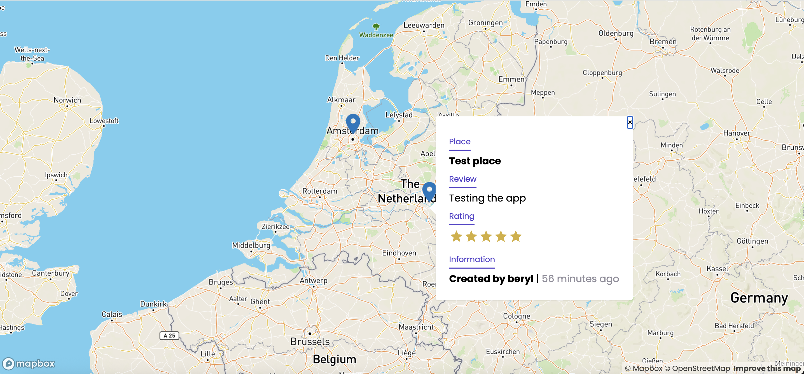

# Map Pin App

A map app where users can pin their favourite places and experiences and share them with other users.

🚧 **Work in progress.** The map, pin display and API are working. I'm currently adding the add-pin form, login in the UI and a redesign.

<!-- Add a screenshot:  -->
<!-- Add the live link here once deployed -->

## What works today

- Interactive Mapbox map that loads saved pins from the API
- Markers with a popup showing the place title, review, author and how long ago it was added
- Double-click the map to place a new pin
- REST API for pins (create and list) and users (register and login with hashed passwords)

## Roadmap

- [ ] Add-pin form (title, review, rating) connected to the API
- [ ] Register and login screens
- [ ] Interactive star ratings
- [ ] Redesign and mobile layout
- [ ] Deployment

## Tech stack

**Client:** React · TypeScript · Mapbox GL (`react-map-gl`) · Material UI · styled-components · Axios
**Server:** Node.js · Express · TypeScript · MongoDB (Mongoose) · bcrypt

## Run it locally

You need Node.js, a free [MongoDB Atlas](https://www.mongodb.com/atlas) cluster and a free [Mapbox](https://www.mapbox.com) access token.

**Server**

```bash
cd server
npm install
echo 'MONGODB_URI=your-connection-string' > .env
npx tsc
npm start
```

The API runs on http://localhost:4000.

**Client**

```bash
cd client
npm install --legacy-peer-deps
echo 'REACT_APP_MAPBOX_API=your-mapbox-token' > .env
npm start
```

The app opens on http://localhost:3000 and sends API requests to the server through the `proxy` setting in `package.json`.

## API

| Method | Route | Description |
|--------|-------|-------------|
| GET | `/api/pins` | List all pins |
| POST | `/api/pins` | Create a pin (`userName`, `title`, `desc`, `rating`, `lat`, `long`) |
| POST | `/api/users/register` | Register a user |
| POST | `/api/users/login` | Log in |
